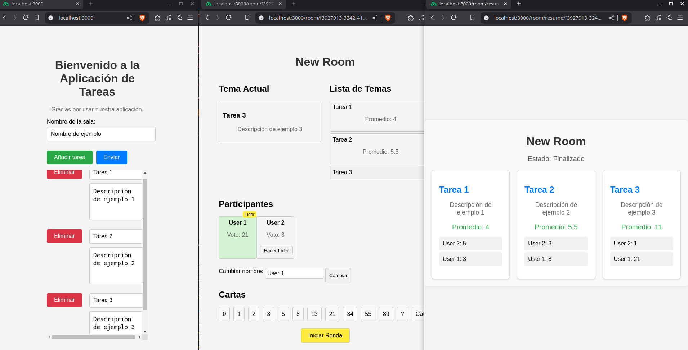

# Bunny Estimates

Bunny Estimates es una aplicación de planning poker que ayuda a los equipos a estimar el esfuerzo necesario para completar tareas en un proyecto. Utiliza la técnica de planning poker para fomentar la colaboración y obtener estimaciones más precisas.

## Características

- Crear y gestionar sesiones de planning poker.
- Invitar a miembros del equipo a las sesiones.
- Estimar tareas utilizando cartas de planning poker.
- Visualizar resultados y estadísticas de las estimaciones.

## Captura de Pantalla



## Instalación

1. Clona el repositorio:
    ```bash
    git clone https://github.com/tu-usuario/bunny-estimates.git
    ```
2. Navega al directorio del proyecto:
    ```bash
    cd bunny-estimates
    ```
3. Abre el proyecto con los devcontainers

## Uso

1. Abre tu navegador y navega a `http://localhost:3000` para ver la aplicación en funcionamiento.

## Contribuir

Si deseas contribuir a Bunny Estimates, por favor sigue estos pasos:

1. Haz un fork del repositorio.
2. Crea una nueva rama (`git checkout -b feature/nueva-funcionalidad`).
3. Realiza tus cambios y haz commit (`git commit -am 'Añadir nueva funcionalidad'`).
4. Sube tus cambios a tu fork (`git push origin feature/nueva-funcionalidad`).
5. Abre un Pull Request en GitHub.

